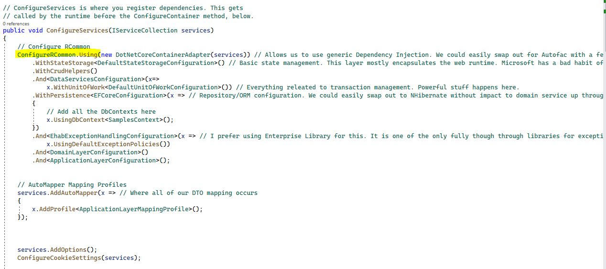
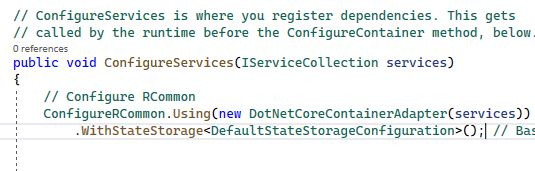

# Configuration

The simplest way to configure RCommon is to use the configuration entry point serves as a fluent dependency injection interface for bootstrapping the framework and all its necessary dependencies. From there you'll need to choose which dependency injection container to use and instantiate the [correlated adapter](dependency-injection/di-providers/) so that RCommon knows which container to use to register and resolve dependencies from.&#x20;

### Minimum Configuration

At minimum, you will need to configure a container adapter and state storage. We recommend using the "DefaultStateStorageConfiguration" as that will bootstrap both web and non-web applications with minimal [application state storage options](application-state.md).

### More Useful Configurations

Generally speaking, you'll want to configure RCommon with some of its more useful features such as:&#x20;

* [Persistence](persistence/)
* [Unit of Work & Distributed Unit of Work](transactions-and-unit-of-work.md)
* [Exception Handling](exception-handling/)
* [Distributed Messaging via MassTransit](../infrastructure/masstransit.md)
* [Mediator Behaviors Pipeline via MediatR](../infrastructure/mediatr-pipeline.md)
* [Background Jobs](../infrastructure/background-jobs.md)
* and other utilities
  * [Time/Date ](../infrastructure/time-and-date.md)
  * [Guid Generation](../infrastructure/guid-generation.md)
  * [Email](../infrastructure/email-sending.md)

