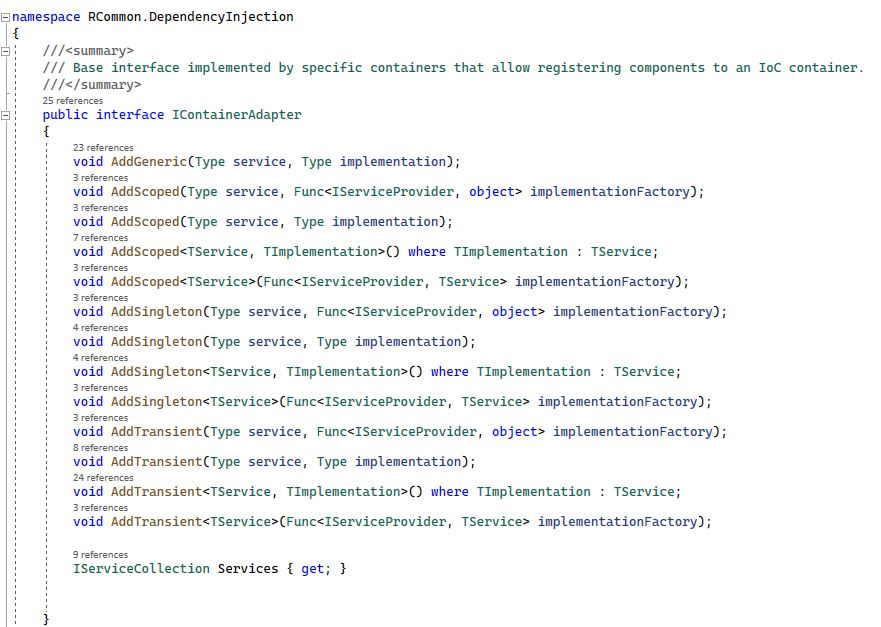

# Dependency Injection

## Overview

Dependency injection (DI) has become ubiquitous in modern application development. It makes so many things easier to deal with but as some dependency injection frameworks have matured, they have introduced various utilities (e.g. dependency scanning) which are not supported by all dependency injection frameworks, but are useful nonetheless.&#x20;

One of the primary tenants of RCommon is flexibility which requires that we give developers the freedom to choose whatever dependency injection framework they are comfortable with. As  result, we have utilized abstractions for dependency injection. We've also tried to keep configuration of DI pretty straight-forward - there is not any assembly/dependency scanning, pattern-based convention scanning, or other auto-bootstrapping logic involved. All configurations within RCommon have explicit abstraction/implementation definitions so that you, the developer, are not stuck trying to figure out how/why/what abstractions are used.&#x20;

### Configuration Examples

Below is a common configuration scenario. Many more are covered in the Configuration documentation but this will give you the gist:&#x20;

```
        // ConfigureServices is where you register dependencies. This gets
        // called by the runtime before the ConfigureContainer method, below.
        public void ConfigureServices(IServiceCollection services)
        {
            // Configure RCommon
            ConfigureRCommon.Using(new DotNetCoreContainerAdapter(services)) // Allows us to use generic Dependency Injection. We could easily swap out for Autofac with a few lines of code
                .WithStateStorage<DefaultStateStorageConfiguration>() // Basic state management. This layer mostly encapsulates the web runtime. Microsoft has a bad habit of revising what an HttpContext is/means so we limit that impact.
                .And<DataServicesConfiguration>(x=>
                    x.WithUnitOfWork<DefaultUnitOfWorkConfiguration>()) // Everything releated to transaction management. Powerful stuff happens here.
                .WithPersistence<EFCoreConfiguration>(x => // Repository/ORM configuration. We could easily swap out to NHibernate without impact to domain service up through the stack
                {
                    // Add all the DbContexts here
                    x.UsingDbContext<SamplesContext>();
                });
        }
        
```

To begin configuring RCommon, you must pass in the dependency injection container adapter you wish to use into the configuration entry point. We've created adapters for commonly used providers.


&#x20;Once the container adapter has been instantiated and passed into the RCommon configuration entry point, you may configure the container using any strategy you wish. We recommend that you continue using the DI container adapter to register dependencies as that will allow you to keep your application truly future proofed from evolving or deprecated DI containers.  But once the container is created, you may use whatever strategy you want for container configuration.&#x20;


### IContainerAdapter Interface

We support relatively straight-forward dependency injection via IContainerAdapter. Ultimately each provider created extensions so that your registrations may be handled through the IServiceCollection interface. Our container adapters merely implement the registration interfaces.


