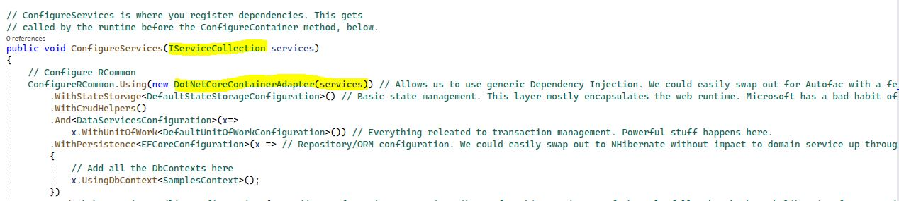

# Microsoft

Microsoft has created fairly comprehensive [documentation](https://docs.microsoft.com/en-us/dotnet/core/extensions/dependency-injection) so we won't attempt to recompose that. Suffice to say that once you've created a host/program which exposes [IServiceProvider](https://docs.microsoft.com/en-us/dotnet/api/system.iserviceprovider?view=net-6.0), you will likely have a method such as the following from which you will pass the IServiceCollection interface into the RCommon [configuration entry point](../../configuration.md) using the DotNetCoreContainerAdapter:

